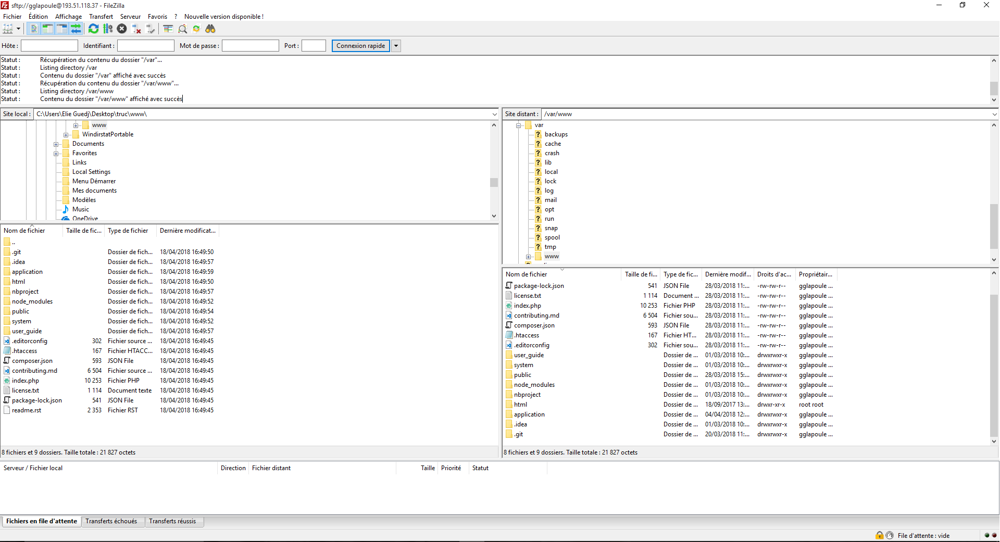
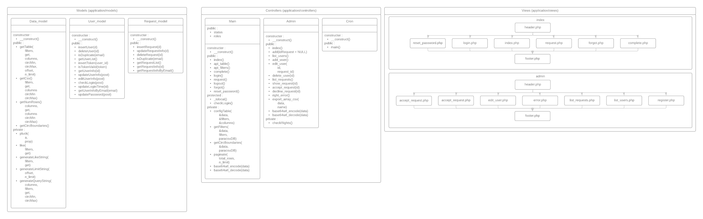

# Contexte

DataParacou est une application web d'extraction et de tri des données Guyafor avec système de gestion des utilisateurs.

L'application permet aux chercheurs de trier les données de Paracou à l'aide de filtres intuitifs et d'extraire ces données filtrées en CSV

DataParacou est développé en PHP sous le framework CodeIgniter

# Fonctionnalités

# Modifications simples
Les modifications simples peuvent s’effectuer à l’aide des fichiers de configurations situés dans « application/config » de la racine du projet

| Nom du fichier | Module correspondant                |
| :------------- | :-------------                      |
| datatable.php  | Configuration de la table           |
| email.php      | Identifiants e-mail                 |
| database.php   | Identifiants des bases de données   |
| pagination.php | Configuration de la pagination      |
| routes.php     | Redirections URL vers controleur    |
## Modifier la table (datatable.php)

#### Colonnes à extraire
La modification des colonnes à extraire s'effectue dans ce tableau :
```php
// Colonnes à aller chercher dans la base de donnée
 $config['columns'] = array(
    'Forest',
    'Plot',
    'SubPlot',
    'TreeFieldNum',
    'PlotSurface',
    'idTree',
    'Xfield',
    'Yfield',
    'Xutm',
    'Yutm',
    'Lat',
    'Lon',
    'VernName',
    'Circ',
    'CircCorr',
    'CodeAlive',
    'CodeMeas',
    'CensusYear',
    'Family',
    'Genus',
    'Species',
    'BotaSource',
    'BotaCertainty'
  );
```
Les colonnes utilisées par l’application sont désignées au début du fichier datatable.php, elles seront contenues dans le CSV extrait.

Les colonnes qui doivent apparaitre dans la table doivent être nécessairement déclarées ici.

#### En-têtes de la table principale

La configuration des nom de l'en-tête de la table principale s'effectue dans ce tableau :
```php
// Nom des headers (à ordonner par rapport aux colonnes),
// "<Nom colonne>" => "<Annotation au survol de la souris>"
$config["headers"] = array(
    "Forest" => "",
    "Plot" => "Each plot is subdivided into 4 subplots (125x125m), excepted for plot 16 (25 subplots (100x100m))",
    "Subplot" => "",
    "Tree Field number" => "Tree number as labelled in the field",
    "Plot area" => "in ha",
    "Tree id" => "Unique id for each tree in the database",
    "X Field" => "position (in m within the subplot, taken from the SO corner)",
    "Y Field" => "position (in m within the subplot, taken from the SO corner)",
    "X UTM (Zone 22)" => "",
    "Y UTM (Zone 22)" => "",
    "Latitude" => "",
    "Longitude" => "",
    "Vern name" => "",
    "Circumference" => "",
    "Circumference corrected" => "",
    "Status" => "0 = dead ; 1 = alive",
    "Measure code" => "",
    "Year of census" => "",
    "Family" => "",
    "Genus" => "",
    "Species" => "",
    "Botanical source" => "Bota = a botanist has identified the tree ; Vern = botanical name is obtained from Vern Name",
    "Safety index"  => "-1 no identification ; 0 unknown family ; 1 unknown genus ; 2 unknown species ; 3 known species but low confidence ; 4 known species with high confidence"
);
```
La modification des annotations au survol de la souris (tooltips) s'effectue également dans ce tableau, la clé étant le nom de la colonne et la valeur le tooltip.

Le tableau colonne doit être ordonné de la même façon que le tableau des header, sous peine d'avoir un nom de colonne qui ne correspondent pas à la donnée.

#### Forme de la table
*Pré-requis :*
- HTML/CSS
- [Bootstrap table classes](https://getbootstrap.com/docs/4.0/content/tables/)

La forme et le design de la table se configurent dans ce tableau :
```php
$tableRelativeFontSize = 80; // Taille relative de la table en % (modifie aussi la taille de la police)

$config['table_template'] = array (
    'table_open' => "<table id=\"datatable\" class=\"table table-responsive table-striped table-bordered\" width=\"100%\" style=\"font-size: $tableRelativeFontSize%;\" cellspacing=\"0\">",

    'heading_row_start'   => '<tr>',
    'heading_row_end'     => '</tr>',
    'heading_cell_start'  => '<th>',
    'heading_cell_end'    => '</th>',

    'row_start'           => '<tr>',
    'row_end'             => '</tr>',
    'cell_start'          => '<td>',
    'cell_end'            => '</td>',

    'row_alt_start'       => '<tr>',
    'row_alt_end'         => '</tr>',
    'cell_alt_start'      => '<td>',
    'cell_alt_end'        => '</td>',

    'table_close'         => '</table>'
);
```

`$tableRelativeFontSize` est la variable qui détermine quelle taille prendra le tableau sur l'écran, plus sa valeur est petite plus la table sera petite.

#### Filtres à utiliser
C'est le nom dans la base de filtres qui seront utilisés dans la requête SQL
```php
$config['filters'] = array(
    "Plot",
    "CodeAlive",
    "CensusYear",
    "VernName",
    "Family",
    "Species",
    "Genus"
);
```

Modifier ce tableau peut causer des erreurs, il sera explicité dans la partie modifications complexe

#### Bornes par défaut de Circ
Ce sont les bornes pré-sélectionnées de Circ pour les filtres
```php
$config['defaultCircBoundaries'] = array(
    'circMin' => 10,
    'circMax' => 150
);
```

## Modifier les identifiants de la BDD et de l'e-mail (database.php et email.php)

En cas de changement de base de données ou de compte mail, on peut modifier les identifiants via les fichiers de configuration database.php et email.php

[Documentation CodeIgniter database](https://www.codeigniter.com/user_guide/database/configuration.html)

[Documentation CodeIgniter email](https://www.codeigniter.com/user_guide/libraries/email.html)

database.php :
```php
$active_group = 'default';
$query_builder = TRUE;
// Base de données utilisateurs
$db['default'] = array(
	'dsn'	=> '',
	'hostname' => 'localhost',
	'username' => 'USERNAME',
	'password' => 'PASSWORD',
	'database' => 'users',
	'dbdriver' => 'mysqli',
	'dbprefix' => '',
	'pconnect' => FALSE,
	'db_debug' => (ENVIRONMENT !== 'production'),
	'cache_on' => FALSE,
	'cachedir' => '',
	'char_set' => 'utf8',
	'dbcollat' => 'utf8_general_ci',
	'swap_pre' => '',
	'encrypt' => FALSE,
	'compress' => FALSE,
	'stricton' => FALSE,
	'failover' => array(),
	'save_queries' => TRUE
);
// Base de données Paracou
$db['paracou'] = array(
	'dsn'	=> 'pgsql:host=IP ou DOMAINENAME;port=5432;dbname=DBNAME;user=USERNAME;password=PASSWORD',
	'hostname' => 'IP ou NOM DE DOMAINE',
	'username' => 'USERNAME',
	'password' => 'PASSWORD',
	'database' => 'DBNAME',
	'dbdriver' => 'pdo',
	'dbprefix' => '',
	'pconnect' => FALSE,
	'db_debug' => (ENVIRONMENT !== 'production'),
	'cache_on' => FALSE,
	'cachedir' => '',
	'char_set' => 'utf8',
	'dbcollat' => 'utf8_general_ci',
	'swap_pre' => '',
	'encrypt' => FALSE,
	'compress' => FALSE,
	'stricton' => FALSE,
	'failover' => array(),
	'save_queries' => TRUE
);
```
email.php :
```php
$config["email"] = array(
    'charset'     => 'utf-8',
    'mailtype'    => 'html',
    'protocol'    => 'SMTP', // PROTOCOL
    'smtp_host'   => 'IP OU DOMAINNAME',
    'smtp_user'   => 'USER',
    'smtp_pass'   => 'PASSWORD',
    'smtp_port'   => 587 // PORT
);
```

## Modifier la forme de la pagination (pagination.php)

*Pré-requis :*
- HTML/CSS

[Documentation Codeigniter pagination](https://www.codeigniter.com/userguide3/libraries/pagination.html)

```php
$config['pagination'] = array (
    "full_tag_open" => '<ul class="pagination justify-content-center">' ,
    "full_tag_close" => '</ul>' ,
    "first_link" => true,
    "last_link" => true,
    "attributes" => array('class' => 'page-link'),
    "first_tag_open" => '<li class="page-item">' ,
    "first_tag_close" => '</li>' ,
    "first_link" => 'First',
    "prev_link" => '&laquo' ,
    "prev_tag_open" => '<li class="page-item prev">' ,
    "prev_tag_close" => '</li>' ,
    "next_link" => '&raquo' ,
    "next_tag_open" => '<li class="page-item">' ,
    "next_tag_close" => '</li>' ,
    "last_tag_open" => '<li class="page-item">' ,
    "last_tag_close" => '</li>' ,
    "last_link" => 'Last',
    "cur_tag_open" => '<li class="page-item active"><a href="#" class="page-link">' ,
    "cur_tag_close" => '</a></li>' ,
    "num_tag_open" => '<li class="page-item">' ,
    "num_tag_close" => '</li>' ,
    "page_query_string" =>  TRUE,
    "use_page_numbers" =>  TRUE,
    "reuse_query_string" =>  TRUE,
    "query_string_segment" =>  'page'
);
```

## Modifier les URL du site (route.php)

*Pré-requis :*
- Bases de PHP orienté objet
- Bases en developpement MVC

Vous trouverez les informations pour comprendre comment fonctionne le routage dans CodeIgniter dans la documentation
[Documentation CodeIgniter routing](https://www.codeigniter.com/userguide3/general/routing.html)

```php
// $route['URL'] = 'controller';
$route['default_controller'] = 'main';
$route['admin'] = 'admin';
$route['admin/delete_user/(:num)'] = 'admin/delete_user/$1';
$route['admin/delete_request/(:num)'] = 'admin/delete_request/$1';
$route['admin/accept_request/(:num)'] = 'admin/accept_request/$1';
$route['admin/show_request/(:num)'] = 'admin/show_request/$1';
$route['admin/edit_user/user-(:num)/request-(:num)'] = 'admin/edit_user/$1/$2';
$route['admin/add_user/(:num)'] = 'admin/add_user/$1';
$route['404_override'] = '';
$route['translate_uri_dashes'] = FALSE;
```

Si vous souhaitez juste modifier un lien vous devez modifier la partie URL du routage.

Après avoir modifié l'URL il faudra modifier les liens correspondants dans les vues situées dans le dossier view.

Par exemple si on veut modifier add_user en add :

  `$route['admin/add/(:num)'] = 'admin/add_user/$1';`

Il faudra ensuite modifier les vues contenant les liens redirigeant vers cet URL :

  par exemple : dans application/views/list_users.php
  
  `<a class="m-2 btn btn-primary" href="<?php echo base_url()."admin/add_user/"; //Modifier en admin/add/ ?>">Add user  <i class="fas fa-plus-circle"></i></a>`
  
  **...**
  
## Tester l'application en local

### Installation d'un serveur de developpement
Après avoir modifié un composant du site, il doit être impérativement testé avant la mise en ligne.
Pour ça il faut installer un serveur de développement pour pouvoir executer l'application et ainsi tester si les changements n'ont créés aucun bugs.

/!\ Utiliser un serveur web avec une version php < 7.x peut causer des bugs /!\

- [EasyPHP Devserver](http://www.easyphp.org/) :
    - Simple d'utilisation, mais peu extensible [Tutoriel d'installation](https://www.chireux.fr/mp/info/BDD/Tutoriel%20EasyPHP.pdf)
- [Xampp](https://www.apachefriends.org/fr/index.html) :
    - Simple à installer, et à utiliser, mais reste extensible (recommandé) [Tutoriel d'installation](https://www.1and1.fr/digitalguide/serveur/outils/tutoriel-xampp-creer-un-serveur-de-test-local/)
- [Wamp](http://www.wampserver.com/) :
    - Difficile à installer, se comporte comme un serveur web apache sous linux [Tutoriel d'installation](https://craym.eu/tutoriels/developpement/site_local_avec_wamp.html)

Modifier le fichier application/config/database.php
Changer les identifiants de la base users par ceux choisis lors de l'installation du serveur de developpement

### Importation de la structure de la base
Après l'installation d'un serveur de développement il faut importer la structure de la base de données dans le serveur local

Un MySQL dump contenant la structure de la base "users" ainsi qu'un compte administrateur est contenu dans le dossier : documentation/MySQL_Dumps
 - Accéder à PhpMyAdmin *(voir documentation du serveur de developpement choisi)*.
 > 127.0.0.1:<port choisi 80, 8080 ou 8000>/phpmyadmin
 - Créer une database "users"
 - Importer le dump "users.sql"

### Éxecuter et tester les changements

Après avoir importé le dump dans votre base de données locale, vous devez maintenant copier les fichiers du projet dans le repertoire lu par votre serveur de développement.

Cela diffère selon le serveur de développement choisi

- [EasyPHP Documentation](http://www.easyphp.org/documentation/devserver/setup-your-environment.php)

- [Xampp Documentation "Where should I place my web content?"](https://www.apachefriends.org/faq_windows.html)

- Wamp : <Répertoire d'installation>\wamp64\www

Après avoir copié les fichiers du projet, vous pouvez accéder à l'application à l'adresse :

 > 127.0.0.1:<port choisi (80, 8080 ou 8000)>

Identifiants du compte pré-enregistrés dans le dump importé :
> Identifiant admin : admin@admin.com

> Mot de passe admin : #u5Sd_d5!D
## Téléverser les changements sur le serveur
Après avoir modifié et testé les fichiers en local, il faut téléverser les fichiers pour appliquer les changement

Identifiants serveur Montpellier :

Identifiants serveur Kourou :

[Filezilla](https://filezilla-project.org/)

/var/www/


# Modifications avancées

Les modifications avancées du site demandent la compréhension de la structure du site et la maîtrise de certains pré-requis qui seront précisés dans les sous-parties de ce chapitre.

Pour cela, sera détaillé le fonctionnement et la structure interne de l'application.

## Structure

*Pré-requis :*
- Programmation orienté objet (lecture UML)
- Architecture MVC
- Base de données (lecture schéma entité-association)
- Compréhension du rôle des technologies web (front-end/back-end)

### Technologies employées
#### Front-end :

-	HTML5 : Langage de balisage, utilisé pour structurer les pages web
-	CSS3 : Langage de style, pour styliser les pages web
-	JavaScript ES6 : Langage de programmation frontal, pour animer les pages web
-	Bootstrap v4 : Framework « boite à outil » CSS/JavaScript pour l’aide au design de sites responsives ([Documentation](https://getbootstrap.com/))
-	JQuery : Bibliothèque JavaScript qui facilite l’écriture de code JavaScript pour la manipulation des pages HTML ([Documentation](https://jquery.com/))
-	JQuery UI : Collection d’objets pour la création d’interfaces utilisateur, fonctionne avec JQuery ([Documentation](https://jqueryui.com/))
-	Select2 : Boite de multi-sélection écrite en JQuery ([Documentation](https://select2.org/))
-	DateRangePicker : Composant de sélection de date, élaboré pour fonctionner avec Bootstrap ([Documentation](http://www.daterangepicker.com/))
-	Moment.js : Dépendance de DateRangePicker, manipule les dates en JavaScript  ([Documentation](https://momentjs.com/))
-	Popper.js : Gestion des tooltips (annotations au survol) avec bootstrap ([Documentation](https://popper.js.org/))
-	FontAwesome : Collection d’icônes ([Documentation](https://fontawesome.com/))
-	DataTable : Plugin JQuery pour la gestion de tableau de données ([Documentation](https://datatables.net/))

#### Back-end :

-	Apache : Serveur HTTP, traite les requêtes
-	PHP 7 : Langage de programmation orienté objet serveur ([Documentation](http://php.net/docs.php))
-	MySQL : Système de gestion de bases de données relationnelles ([Documentation](https://dev.mysql.com/doc/))
-	PostgreSQL : Système de gestion de base de données relationnelle et objet ([Documentation](https://www.postgresql.org/docs/))
-	CodeIgniter : Framework web MVC ([Documentation](https://www.codeigniter.com/user_guide/))
-	Cron : Service d’exécution de tâches périodique Linux ([Documentation](https://doc.ubuntu-fr.org/cron))

### Structure du code
[Architecture MVC](https://developer.mozilla.org/fr/Apps/Build/Architecture_d_une_application_web_moderne/MVC_architecture)

Diagramme UML de l'application


Flow chart CodeIgniter


#### Modèles :
- application/models/Data_model.php
    - Contient les fonctions destinées à l'utilisation des données Guyafor
- application/models/User_model.php
    - Contient les fonctions destinées à manipuler les utilisateurs
- application/models/Request_model.php
    - Contient les fonctions destinées à manipuler les requêtes

#### Controleurs :
- application/controllers/Main.php
    - Le controleur "main" contient les fonctions d'authentifications, les fonctions API de génération de la table et la fonction index qui crée la page principale
    - Les fonctions encapsulées publiques sont les procédures qui génèrent les pages principales de l'application
    - Les fonctions encapsulées protégées et privées sont des fonctions qui sont utilisées au sein du controleur (afin d'éviter la redondance du code)
- application/controllers/Admin.php
    - Le controleur "admin" contient les fonctions de gestion des utilisateurs et des requêtes
    - Les fonctions encapsulées publiques sont les procédures qui génèrent les pages d'administration de l'application
    - Les fonctions encapsulées protégées et privées sont des fonctions qui sont utilisées au sein du controleur (afin d'éviter la redondance du code)
- application/controllers/Cron.php
    - Le controleur Cron est uniquement executable par CLI (ligne de commande), elle ne contient qu'une seule fonction qui est executée périodiquement par le service Cron du serveur où l'application est installé
    - Cette fonction crée des fichiers cache qui seront utilisés par la fonction api_filters() du controleur Main.php

#### Vues :
- application/views/
    - Dossier contenant les vues appelées par le controleur Main.php
    - Le header et le footer sont toujours appelés respectivement au début et à la fin de chaque page, ils contiennent les librairies javascript intégrés à la page
- application/view/admin
    - Dossier contenant les vues appelées par le controleur Admin.php
    - Le header et le footer sont toujours appelés respectivement au début et à la fin de chaque page, ils contiennent les librairies javascript intégrés à la page
